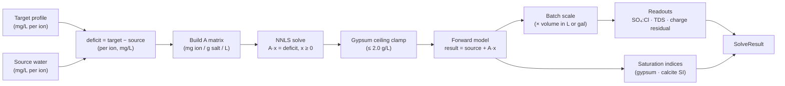

# Waterforge — Architecture Overview

## Stack

| Layer             | Technology                    | Why                                                                                                                         |
| ----------------- | ----------------------------- | --------------------------------------------------------------------------------------------------------------------------- |
| UI framework      | Svelte 5 (runes)              | Fine-grained reactivity without a virtual DOM; runes replace the older store/reactive-statement model with explicit signals |
| Build tool        | Vite 8                        | Fast ESM-based dev server; static build with `base: './'` so the output works from any GitHub Pages subpath                 |
| Language          | TypeScript                    | Type-safe stoichiometry and matrix math; catches unit-confusion bugs at compile time                                        |
| Styling           | Tailwind CSS v4 (Vite plugin) | Utility-first; v4's Vite-native plugin avoids a PostCSS step                                                                |
| Component library | shadcn-svelte + Bits UI       | Copy-owned, accessible primitives; no runtime dependency on a component framework version                                   |
| Deploy target     | GitHub Pages (static)         | Zero server cost, private by default, durable — see ADR 0006                                                                |
| Runtime           | Browser only                  | No backend, no accounts, no telemetry                                                                                       |

**Why plain Vite, not SvelteKit?** The app has no server-side concerns: no SSR,
no API routes, no dynamic routing. SvelteKit's adapter layer adds complexity that
buys nothing here. A plain Vite SPA with a single HTML entrypoint is the simplest
deployment unit (see ADR 0006).

## Module Boundaries

```
src/
  lib/
    chem/           — pure TS: ions, salts, atomic weights, unit conversions
    solver/         — pure TS: matrix, NNLS, oracle, saturation, solve
    index.ts        — re-exports all of chem + solver; the engine's public API
    components/     — Svelte UI components (consume engine via $lib)
  app.css           — Tailwind entry point
  App.svelte        — root Svelte component
```

The `chem/` and `solver/` directories are **framework-agnostic pure
TypeScript**. They import nothing from Svelte, the DOM, or any runtime library.
This boundary is enforced by convention (and will be linted): engine tests run
in a Node environment (`vitest` with `environment: 'node'`), which would fail
immediately if a DOM import snuck in.

The public engine API is `src/lib/index.ts`. UI components import from `$lib`
and never reach into engine sub-modules directly. This keeps the math portable
and independently testable.

## Data Flow

A solve request moves through the engine in a single, linear pass:



**Step-by-step:**

1. **Deficit** — subtract source water ions from target ions (mg/L). Negative
   deficits (source richer than target) cannot be corrected by adding salts; NNLS
   fits them as closely as non-negativity allows.
2. **A matrix** — `buildMatrix(salts)` produces a dense ion × salt matrix whose
   entry `A[ion][salt]` is the milligrams of that ion contributed per gram of salt
   dissolved per litre. Derived purely from stoichiometry and molar masses in
   `chem/constants.ts`.
3. **NNLS** — `nnls(A, b)` solves `min ‖Ax − b‖` subject to `x ≥ 0` via the
   Lawson–Hanson active-set algorithm, vendored in pure TypeScript (no numeric
   library). Non-negativity is essential: you cannot remove a salt that was never
   added (see ADR 0003).
4. **Gypsum ceiling clamp** — if the gypsum dose exceeds 2.0 g/L it is clamped
   to that limit. Gypsum saturates at roughly 2.0–2.5 g/L; above that it simply
   will not dissolve (see ADR 0004 and ADR 0005).
5. **Forward model** — `forward(dose)` computes the ion profile the clamped doses
   actually produce. Result profile = source + forward output.
6. **Batch scale** — per-litre doses multiplied by the requested volume (litres or
   US gallons converted via the exact 3.785411784 L/gal factor).
7. **Readouts** — sulfate:chloride mass ratio, TDS (sum of all modelled ions),
   charge-balance residual (meq/L).
8. **Saturation warnings** — `saturationWarnings(profile)` computes saturation
   indices for gypsum (CaSO₄) and calcite (CaCO₃) and warns when SI ≥ 0
   (activity coefficients assumed = 1, a conservative approximation).

## Revisit Triggers

These are conditions under which the current architectural choices should be
reconsidered:

| Trigger                                                            | Choice to revisit                                                        |
| ------------------------------------------------------------------ | ------------------------------------------------------------------------ |
| Profiles need server-side storage, sharing, or auth                | Static SPA → SvelteKit or similar                                        |
| Engine needs to run in a Node.js CLI or server context             | No change expected; the engine is already framework-agnostic             |
| Ionic-strength effects matter for accuracy                         | Activity coefficients = 1 → implement Davies or Debye-Hückel corrections |
| Multiple interacting sparingly-soluble minerals                    | Single gypsum clamp → coupled Ksp equilibrium solver                     |
| Salt palette grows large enough to cause NNLS convergence issues   | Lawson–Hanson → QP solver or regularised NNLS                            |
| SvelteKit adds a zero-config static adapter with no migration cost | Plain Vite SPA → evaluate SvelteKit                                      |
| Tailwind v4 API stability concerns surface                         | Tailwind v4 → v3 or CSS-modules                                          |
